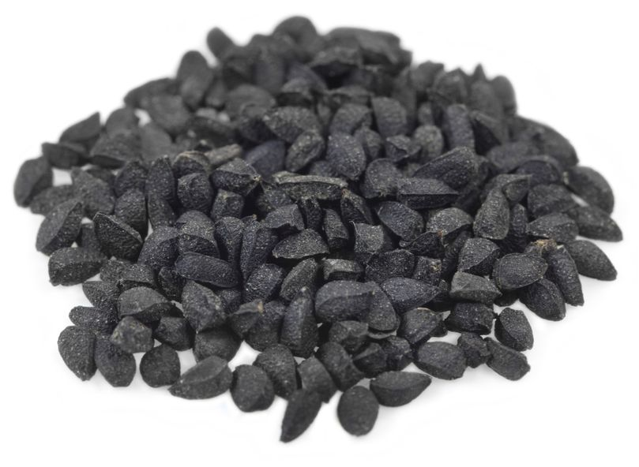

<!DOCTYPE html>
<html lang="en">
<head>
	<title>Authentic Health</title>
	<meta charset="utf-8">
	<meta http-equiv="x-ua-compatible" content="ie=edge">
	<meta name="viewport" content="width=device-width, initial-scale=1">
	<link rel="stylesheet" href="shower/themes/ribbon/styles/screen-16x10.css">
</head>
<body class="shower list">
	<header class="caption">
		<h1>Authentic Health</h1>
		
By Khalid Ahmad Khattak

	</header>
	<section class="slide" id="cover">
		<h2>Authentic Health</h2>
		
Brought to you by <a href="http://www.KhalidKhattak.com/AuthenticHealth.php">Khalid Ahmad Khattak</a>

		
		<!--
			To apply styles to the certain slides
			set slide ID to get needed elements
			-->
		
	</section>
	<section class="slide">
		<h2>Authentic Health Features</h2>
		<ol>
			<li>Search for any health problem</li>
			<li>Symptoms will be provided for the typed health problem</li>
			<li>Treatments by English Medicine option</li>
			<li>Treatments by Homeopathic option</li>
			<li>Treatments by Religious text option</li>
			<li>Treatments by Home remedy option</li>
            <li>Each treatment will be fully referenced</li>
		</ol>
		<!-- 
Shower ['ʃəuə] noun. A person or thing that shows.
     -->
	</section>
	<section class="slide">
		<h2>Simple Exerices for each part of the body</h2>
        <ol>
			<li>Exercises for upper body</li>
			<li>Exercises for middle body</li>
			<li>Exercises for Lower body</li>
		</ol>
    </section>
	<section class="slide">
		<h2>Exercise for upper body</h2>
         <ol>
			<li>Exercise 01 + precautions</li>
			<li>Exercise 02 + precautions</li>
			<li>Exercise 03 + precautions</li>
			<li>Exercise 04 + precautions</li>
			<li>Exercise 05 + precautions</li>
			<li>Exercise 06 + precautions</li>
		</ol>
        </section>
	<section class="slide">
		<h2>Exercise for middle body</h2>
         <ol>
			<li>Exercise 01 + precautions</li>
			<li>Exercise 02 + precautions</li>
			<li>Exercise 03 + precautions</li>
			<li>Exercise 04 + precautions</li>
			<li>Exercise 05 + precautions</li>
			<li>Exercise 06 + precautions</li>
		</ol>
        </section>
	<section class="slide">
		<h2>Exercise for lower body</h2>
         <ol>
			<li>Exercise 01 + precautions</li>
			<li>Exercise 02 + precautions</li>
			<li>Exercise 03 + precautions</li>
			<li>Exercise 04 + precautions</li>
			<li>Exercise 05 + precautions</li>
			<li>Exercise 06 + precautions</li>
		</ol>
        </section>

	<section class="slide" id="picture">
		<h2>Pictures</h2>
		
		
	</section>

    	<section class="slide" id="picture">
		<h2>Pictures</h2>
		
		
	</section>

	

		<a href="https://github.com/shower/shower">Fork me on GitHub</a>
	

	<!--
		To hide progress bar from entire presentation
		just remove “progress” element.
		-->
	

	
	<!-- Copyright © 2016 Yours Truly, KhalidKhattak.com. -->
	<!-- Photos by anonymous -->
</body>
</html>
